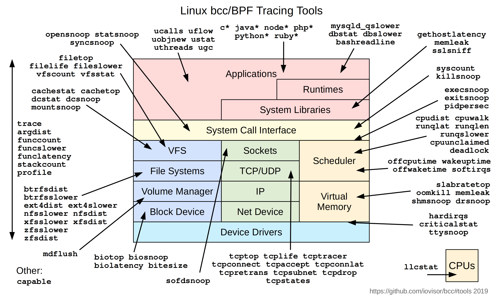

# BPF Compiler Collection (BCC)

BCC is a toolkit for creating efficient kernel tracing and manipulation
programs, and includes several useful tools and examples. It makes use of
extended BPF (Berkeley Packet Filters), formally known as eBPF, a new feature
that was first added to Linux 3.15. Much of what BCC uses requires Linux 4.1
and above.

eBPF was [described by](https://lkml.org/lkml/2015/4/14/232) Ingo Molnár as:

> One of the more interesting features in this cycle is the ability to attach eBPF programs (user-defined, sandboxed bytecode executed by the kernel) to kprobes. This allows user-defined instrumentation on a live kernel image that can never crash, hang or interfere with the kernel negatively.

BCC makes BPF programs easier to write, with kernel instrumentation in C
(and includes a C wrapper around LLVM), and front-ends in Python and lua.
It is suited for many tasks, including performance analysis and network
traffic control.

## Screenshot

This example traces a disk I/O kernel function, and populates an in-kernel
power-of-2 histogram of the I/O size. For efficiency, only the histogram
summary is returned to user-level.

```Shell
# ./bitehist.py
Tracing... Hit Ctrl-C to end.
^C
     kbytes          : count     distribution
       0 -> 1        : 3        |                                      |
       2 -> 3        : 0        |                                      |
       4 -> 7        : 211      |**********                            |
       8 -> 15       : 0        |                                      |
      16 -> 31       : 0        |                                      |
      32 -> 63       : 0        |                                      |
      64 -> 127      : 1        |                                      |
     128 -> 255      : 800      |**************************************|
```

The above output shows a bimodal distribution, where the largest mode of
800 I/O was between 128 and 255 Kbytes in size.

See the source: [bitehist.py](examples/tracing/bitehist.py). What this traces,
what this stores, and how the data is presented, can be entirely customized.
This shows only some of many possible capabilities.

## Installing

See [INSTALL.md](INSTALL.md) for installation steps on your platform.

## FAQ

See [FAQ.txt](FAQ.txt) for the most common troubleshoot questions.

## Reference guide

See [docs/reference_guide.md](docs/reference_guide.md) for the reference guide to the bcc and bcc/BPF APIs.

## Contents

Some of these are single files that contain both C and Python, others have a
pair of .c and .py files, and some are directories of files.

### Tracing

#### Examples

- examples/tracing/[bitehist.py](examples/tracing/bitehist.py): Block I/O size histogram. [Examples](examples/tracing/bitehist_example.txt).
- examples/tracing/[disksnoop.py](examples/tracing/disksnoop.py): Trace block device I/O latency. [Examples](examples/tracing/disksnoop_example.txt).
- examples/[hello_world.py](examples/hello_world.py): Prints "Hello, World!" for new processes.
- examples/tracing/[mysqld_query.py](examples/tracing/mysqld_query.py): Trace MySQL server queries using USDT probes. [Examples](examples/tracing/mysqld_query_example.txt).
- examples/tracing/[nodejs_http_server.py](examples/tracing/nodejs_http_server.py): Trace Node.js HTTP server requests using USDT probes. [Examples](examples/tracing/nodejs_http_server_example.txt).
- examples/tracing/[stacksnoop](examples/tracing/stacksnoop.py): Trace a kernel function and print all kernel stack traces. [Examples](examples/tracing/stacksnoop_example.txt).
- tools/[statsnoop](tools/statsnoop.py): Trace stat() syscalls. [Examples](tools/statsnoop_example.txt).
- examples/tracing/[task_switch.py](examples/tracing/task_switch.py): Count task switches with from and to PIDs.
- examples/tracing/[tcpv4connect.py](examples/tracing/tcpv4connect.py): Trace TCP IPv4 active connections. [Examples](examples/tracing/tcpv4connect_example.txt).
- examples/tracing/[trace_fields.py](examples/tracing/trace_fields.py): Simple example of printing fields from traced events.
- examples/tracing/[undump.py](examples/tracing/undump.py): Dump UNIX socket packets. [Examples](examples/tracing/undump_example.txt)
- examples/tracing/[urandomread.py](examples/tracing/urandomread.py): A kernel tracepoint example, which traces random:urandom_read. [Examples](examples/tracing/urandomread_example.txt).
- examples/tracing/[vfsreadlat.py](examples/tracing/vfsreadlat.py) examples/tracing/[vfsreadlat.c](examples/tracing/vfsreadlat.c): VFS read latency distribution. [Examples](examples/tracing/vfsreadlat_example.txt).
- examples/tracing/[kvm_hypercall.py](examples/tracing/kvm_hypercall.py): Conditional static kernel tracepoints for KVM entry, exit and hypercall [Examples](examples/tracing/kvm_hypercall.txt).

#### Tools
<center><a href="images/bcc_tracing_tools_2019.png"></a></center>


- tools/[argdist](tools/argdist.py): Display function parameter values as a histogram or frequency count. [Examples](tools/argdist_example.txt).
- tools/[bashreadline](tools/bashreadline.py): Print entered bash commands system wide. [Examples](tools/bashreadline_example.txt).
- tools/[bpflist](tools/bpflist.py): Display processes with active BPF programs and maps. [Examples](tools/bpflist_example.txt).
- tools/[capable](tools/capable.py): Trace security capability checks. [Examples](tools/capable_example.txt).
- tools/[compactsnoop](tools/compactsnoop.py): Trace compact zone events with PID and latency. [Examples](tools/compactsnoop_example.txt).
- tools/[criticalstat](tools/criticalstat.py): Trace and report long atomic critical sections in the kernel. [Examples](tools/criticalstat_example.txt)
- tools/[deadlock](tools/deadlock.py): Detect potential deadlocks on a running process. [Examples](tools/deadlock_example.txt).
- tools/[drsnoop](tools/drsnoop.py): Trace direct reclaim events with PID and latency. [Examples](tools/drsnoop_example.txt).
- tools/[funccount](tools/funccount.py): Count kernel function calls. [Examples](tools/funccount_example.txt).
- tools/[inject](tools/inject.py): Targeted error injection with call chain and predicates [Examples](tools/inject_example.txt).
- tools/[klockstat](tools/klockstat.py): Traces kernel mutex lock events and display locks statistics. [Examples](tools/klockstat_example.txt).
- tools/[opensnoop](tools/opensnoop.py): Trace open() syscalls. [Examples](tools/opensnoop_example.txt).
- tools/[readahead](tools/readahead.py): Show performance of read-ahead cache [Examples](tools/readahead_example.txt).
- tools/[reset-trace](tools/reset-trace.sh): Reset the state of tracing. Maintenance tool only. [Examples](tools/reset-trace_example.txt).
- tools/[stackcount](tools/stackcount.py): Count kernel function calls and their stack traces. [Examples](tools/stackcount_example.txt).
- tools/[syncsnoop](tools/syncsnoop.py): Trace sync() syscall. [Examples](tools/syncsnoop_example.txt).
- tools/[threadsnoop](tools/threadsnoop.py): List new thread creation. [Examples](tools/threadsnoop_example.txt).
- tools/[tplist](tools/tplist.py): Display kernel tracepoints or USDT probes and their formats. [Examples](tools/tplist_example.txt).
- tools/[trace](tools/trace.py): Trace arbitrary functions, with filters. [Examples](tools/trace_example.txt).
- tools/[ttysnoop](tools/ttysnoop.py): Watch live output from a tty or pts device. [Examples](tools/ttysnoop_example.txt).
- tools/[ucalls](tools/lib/ucalls.py): Summarize method calls or Linux syscalls in high-level languages. [Examples](tools/lib/ucalls_example.txt).
- tools/[uflow](tools/lib/uflow.py): Print a method flow graph in high-level languages. [Examples](tools/lib/uflow_example.txt).
- tools/[ugc](tools/lib/ugc.py): Trace garbage collection events in high-level languages. [Examples](tools/lib/ugc_example.txt).
- tools/[uobjnew](tools/lib/uobjnew.py): Summarize object allocation events by object type and number of bytes allocated. [Examples](tools/lib/uobjnew_example.txt).
- tools/[ustat](tools/lib/ustat.py): Collect events such as GCs, thread creations, object allocations, exceptions and more in high-level languages. [Examples](tools/lib/ustat_example.txt).
- tools/[uthreads](tools/lib/uthreads.py): Trace thread creation events in Java and raw pthreads. [Examples](tools/lib/uthreads_example.txt).

##### Memory and Process Tools

- tools/[execsnoop](tools/execsnoop.py): Trace new processes via exec() syscalls. [Examples](tools/execsnoop_example.txt).
- tools/[exitsnoop](tools/exitsnoop.py): Trace process termination (exit and fatal signals). [Examples](tools/exitsnoop_example.txt).
- tools/[killsnoop](tools/killsnoop.py): Trace signals issued by the kill() syscall. [Examples](tools/killsnoop_example.txt).
- tools/[kvmexit](tools/kvmexit.py): Display the exit_reason and its statistics of each vm exit. [Examples](tools/kvmexit_example.txt).
- tools/[memleak](tools/memleak.py): Display outstanding memory allocations to find memory leaks. [Examples](tools/memleak_example.txt).
- tools/[numasched](tools/numasched.py): Track the migration of processes between NUMAs. [Examples](tools/numasched_example.txt).
- tools/[oomkill](tools/oomkill.py): Trace the out-of-memory (OOM) killer. [Examples](tools/oomkill_example.txt).
- tools/[pidpersec](tools/pidpersec.py): Count new processes (via fork). [Examples](tools/pidpersec_example.txt).
- tools/[rdmaucma](tools/rdmaucma.py): Trace RDMA Userspace Connection Manager Access events. [Examples](tools/rdmaucma_example.txt).
- tools/[shmsnoop](tools/shmsnoop.py): Trace System V shared memory syscalls. [Examples](tools/shmsnoop_example.txt).
- tools/[slabratetop](tools/slabratetop.py): Kernel SLAB/SLUB memory cache allocation rate top. [Examples](tools/slabratetop_example.txt).

##### Performance and Time Tools

- tools/[dbslower](tools/dbslower.py): Trace MySQL/PostgreSQL queries slower than a threshold. [Examples](tools/dbslower_example.txt).
- tools/[dbstat](tools/dbstat.py): Summarize MySQL/PostgreSQL query latency as a histogram. [Examples](tools/dbstat_example.txt).
- tools/[funcinterval](tools/funcinterval.py): Time interval between the same function as a histogram. [Examples](tools/funcinterval_example.txt).
- tools/[funclatency](tools/funclatency.py): Time functions and show their latency distribution. [Examples](tools/funclatency_example.txt).
- tools/[funcslower](tools/funcslower.py): Trace slow kernel or user function calls. [Examples](tools/funcslower_example.txt).
- tools/[hardirqs](tools/hardirqs.py):  Measure hard IRQ (hard interrupt) event time. [Examples](tools/hardirqs_example.txt).
- tools/[mysqld_qslower](tools/mysqld_qslower.py): Trace MySQL server queries slower than a threshold. [Examples](tools/mysqld_qslower_example.txt).
- tools/[ppchcalls](tools/ppchcalls.py): Summarize ppc hcall counts and latencies. [Examples](tools/ppchcalls_example.txt).
- tools/[softirqs](tools/softirqs.py):  Measure soft IRQ (soft interrupt) event time. [Examples](tools/softirqs_example.txt).
- tools/[syscount](tools/syscount.py): Summarize syscall counts and latencies. [Examples](tools/syscount_example.txt).

##### CPU and Scheduler Tools

- tools/[cpudist](tools/cpudist.py): Summarize on- and off-CPU time per task as a histogram. [Examples](tools/cpudist_example.txt)
- tools/[cpuunclaimed](tools/cpuunclaimed.py): Sample CPU run queues and calculate unclaimed idle CPU. [Examples](tools/cpuunclaimed_example.txt)
- tools/[llcstat](tools/llcstat.py): Summarize CPU cache references and misses by process. [Examples](tools/llcstat_example.txt).
- tools/[offcputime](tools/offcputime.py): Summarize off-CPU time by kernel stack trace. [Examples](tools/offcputime_example.txt).
- tools/[offwaketime](tools/offwaketime.py): Summarize blocked time by kernel off-CPU stack and waker stack. [Examples](tools/offwaketime_example.txt).
- tools/[profile](tools/profile.py): Profile CPU usage by sampling stack traces at a timed interval. [Examples](tools/profile_example.txt).
- tools/[runqlat](tools/runqlat.py): Run queue (scheduler) latency as a histogram. [Examples](tools/runqlat_example.txt).
- tools/[runqlen](tools/runqlen.py): Run queue length as a histogram. [Examples](tools/runqlen_example.txt).
- tools/[runqslower](tools/runqslower.py): Trace long process scheduling delays. [Examples](tools/runqslower_example.txt).
- tools/[wakeuptime](tools/wakeuptime.py): Summarize sleep to wakeup time by waker kernel stack. [Examples](tools/wakeuptime_example.txt).
- tools/[wqlat](tools/wqlat.py): Summarize work waiting latency on workqueue. [Examples](tools/wqlat_example.txt).

##### Network and Sockets Tools

- tools/[gethostlatency](tools/gethostlatency.py): Show latency for getaddrinfo/gethostbyname[2] calls. [Examples](tools/gethostlatency_example.txt).
- tools/[bindsnoop](tools/bindsnoop.py): Trace IPv4 and IPv6 bind() system calls (bind()). [Examples](tools/bindsnoop_example.txt).
- tools/[netqtop](tools/netqtop.py) tools/[netqtop.c](tools/netqtop.c): Trace and display packets distribution on NIC queues. [Examples](tools/netqtop_example.txt).
- tools/[sofdsnoop](tools/sofdsnoop.py): Trace FDs passed through unix sockets. [Examples](tools/sofdsnoop_example.txt).
- tools/[solisten](tools/solisten.py): Trace TCP socket listen. [Examples](tools/solisten_example.txt).
- tools/[sslsniff](tools/sslsniff.py): Sniff OpenSSL written and readed data. [Examples](tools/sslsniff_example.txt).
- tools/[tcpaccept](tools/tcpaccept.py): Trace TCP passive connections (accept()). [Examples](tools/tcpaccept_example.txt).
- tools/[tcpconnect](tools/tcpconnect.py): Trace TCP active connections (connect()). [Examples](tools/tcpconnect_example.txt).
- tools/[tcpconnlat](tools/tcpconnlat.py): Trace TCP active connection latency (connect()). [Examples](tools/tcpconnlat_example.txt).
- tools/[tcpdrop](tools/tcpdrop.py): Trace kernel-based TCP packet drops with details. [Examples](tools/tcpdrop_example.txt).
- tools/[tcplife](tools/tcplife.py): Trace TCP sessions and summarize lifespan. [Examples](tools/tcplife_example.txt).
- tools/[tcpretrans](tools/tcpretrans.py): Trace TCP retransmits and TLPs. [Examples](tools/tcpretrans_example.txt).
- tools/[tcprtt](tools/tcprtt.py): Trace TCP round trip time. [Examples](tools/tcprtt_example.txt).
- tools/[tcpstates](tools/tcpstates.py): Trace TCP session state changes with durations. [Examples](tools/tcpstates_example.txt).
- tools/[tcpsubnet](tools/tcpsubnet.py): Summarize and aggregate TCP send by subnet. [Examples](tools/tcpsubnet_example.txt).
- tools/[tcpsynbl](tools/tcpsynbl.py): Show TCP SYN backlog. [Examples](tools/tcpsynbl_example.txt).
- tools/[tcptop](tools/tcptop.py): Summarize TCP send/recv throughput by host. Top for TCP. [Examples](tools/tcptop_example.txt).
- tools/[tcptracer](tools/tcptracer.py): Trace TCP established connections (connect(), accept(), close()). [Examples](tools/tcptracer_example.txt).
- tools/[tcpcong](tools/tcpcong.py): Trace TCP socket congestion control status duration. [Examples](tools/tcpcong_example.txt).
- tools/[mptcpify](tools/mptcpify.py): Force applications to use MPTCP instead of TCP. [Examples](tools/mptcpify_example.txt).

##### Storage and Filesystems Tools

- tools/[bitesize](tools/bitesize.py): Show per process I/O size histogram. [Examples](tools/bitesize_example.txt).
- tools/[cachestat](tools/cachestat.py): Trace page cache hit/miss ratio. [Examples](tools/cachestat_example.txt).
- tools/[cachetop](tools/cachetop.py): Trace page cache hit/miss ratio by processes. [Examples](tools/cachetop_example.txt).
- tools/[dcsnoop](tools/dcsnoop.py): Trace directory entry cache (dcache) lookups. [Examples](tools/dcsnoop_example.txt).
- tools/[dcstat](tools/dcstat.py): Directory entry cache (dcache) stats. [Examples](tools/dcstat_example.txt).
- tools/[biolatency](tools/biolatency.py): Summarize block device I/O latency as a histogram. [Examples](tools/biolatency_example.txt).
- tools/[biotop](tools/biotop.py): Top for disks: Summarize block device I/O by process. [Examples](tools/biotop_example.txt).
- tools/[biopattern](tools/biopattern.py): Identify random/sequential disk access patterns. [Examples](tools/biopattern_example.txt).
- tools/[biosnoop](tools/biosnoop.py): Trace block device I/O with PID and latency. [Examples](tools/biosnoop_example.txt).
- tools/[dirtop](tools/dirtop.py): File reads and writes by directory. Top for directories. [Examples](tools/dirtop_example.txt).
- tools/[filelife](tools/filelife.py): Trace the lifespan of short-lived files. [Examples](tools/filelife_example.txt).
- tools/[filegone](tools/filegone.py): Trace why file gone (deleted or renamed). [Examples](tools/filegone_example.txt).
- tools/[fileslower](tools/fileslower.py): Trace slow synchronous file reads and writes. [Examples](tools/fileslower_example.txt).
- tools/[filetop](tools/filetop.py): File reads and writes by filename and process. Top for files. [Examples](tools/filetop_example.txt).
- tools/[mdflush](tools/mdflush.py): Trace md flush events. [Examples](tools/mdflush_example.txt).
- tools/[mountsnoop](tools/mountsnoop.py): Trace mount and umount syscalls system-wide. [Examples](tools/mountsnoop_example.txt).
- tools/[virtiostat](tools/virtiostat.py): Show VIRTIO device IO statistics. [Examples](tools/virtiostat_example.txt).

###### Filesystems Tools

- tools/[btrfsdist](tools/btrfsdist.py): Summarize btrfs operation latency distribution as a histogram. [Examples](tools/btrfsdist_example.txt).
- tools/[btrfsslower](tools/btrfsslower.py): Trace slow btrfs operations. [Examples](tools/btrfsslower_example.txt).
- tools/[ext4dist](tools/ext4dist.py): Summarize ext4 operation latency distribution as a histogram. [Examples](tools/ext4dist_example.txt).
- tools/[ext4slower](tools/ext4slower.py): Trace slow ext4 operations. [Examples](tools/ext4slower_example.txt).
- tools/[nfsslower](tools/nfsslower.py): Trace slow NFS operations. [Examples](tools/nfsslower_example.txt).
- tools/[nfsdist](tools/nfsdist.py): Summarize NFS operation latency distribution as a histogram. [Examples](tools/nfsdist_example.txt).
- tools/[vfscount](tools/vfscount.py): Count VFS calls. [Examples](tools/vfscount_example.txt).
- tools/[vfsstat](tools/vfsstat.py): Count some VFS calls, with column output. [Examples](tools/vfsstat_example.txt).
- tools/[xfsdist](tools/xfsdist.py): Summarize XFS operation latency distribution as a histogram. [Examples](tools/xfsdist_example.txt).
- tools/[xfsslower](tools/xfsslower.py): Trace slow XFS operations. [Examples](tools/xfsslower_example.txt).
- tools/[zfsdist](tools/zfsdist.py): Summarize ZFS operation latency distribution as a histogram. [Examples](tools/zfsdist_example.txt).
- tools/[zfsslower](tools/zfsslower.py): Trace slow ZFS operations. [Examples](tools/zfsslower_example.txt).

### Networking

Examples:

- examples/networking/[distributed_bridge/](examples/networking/distributed_bridge): Distributed bridge example.
- examples/networking/[http_filter/](examples/networking/http_filter): Simple HTTP filter example.
- examples/networking/[simple_tc.py](examples/networking/simple_tc.py): Simple traffic control example.
- examples/networking/[simulation.py](examples/networking/simulation.py): Simulation helper.
- examples/networking/neighbor_sharing/[tc_neighbor_sharing.py](examples/networking/neighbor_sharing/tc_neighbor_sharing.py) examples/networking/neighbor_sharing/[tc_neighbor_sharing.c](examples/networking/neighbor_sharing/tc_neighbor_sharing.c): Per-IP classification and rate limiting.
- examples/networking/[tunnel_monitor/](examples/networking/tunnel_monitor): Efficiently monitor traffic flows.
- examples/networking/vlan_learning/[vlan_learning.py](examples/networking/vlan_learning/vlan_learning.py) examples/[vlan_learning.c](examples/networking/vlan_learning/vlan_learning.c): Demux Ethernet traffic into worker veth+namespaces.

### BPF Introspection

Tools that help to introspect BPF programs.

- introspection/[bps.c](introspection/bps.c): List all BPF programs loaded into the kernel. 'ps' for BPF programs. [Examples](introspection/bps_example.txt).

## Motivation

BPF guarantees that the programs loaded into the kernel cannot crash, and
cannot run forever, but yet BPF is general purpose enough to perform many
arbitrary types of computation. Currently, it is possible to write a program in
C that will compile into a valid BPF program, yet it is vastly easier to
write a C program that will compile into invalid BPF (C is like that). The user
won't know until trying to run the program whether it was valid or not.

With a BPF-specific frontend, one should be able to write in a language and
receive feedback from the compiler on the validity as it pertains to a BPF
backend. This toolkit aims to provide a frontend that can only create valid BPF
programs while still harnessing its full flexibility.

Furthermore, current integrations with BPF have a kludgy workflow, sometimes
involving compiling directly in a linux kernel source tree. This toolchain aims
to minimize the time that a developer spends getting BPF compiled, and instead
focus on the applications that can be written and the problems that can be
solved with BPF.

The features of this toolkit include:
* End-to-end BPF workflow in a shared library
  * A modified C language for BPF backends
  * Integration with llvm-bpf backend for JIT
  * Dynamic (un)loading of JITed programs
  * Support for BPF kernel hooks: socket filters, tc classifiers,
      tc actions, and kprobes
* Bindings for Python
* Examples for socket filters, tc classifiers, and kprobes
* Self-contained tools for tracing a running system

In the future, more bindings besides python will likely be supported. Feel free
to add support for the language of your choice and send a pull request!

## Tutorials

- [docs/tutorial.md](docs/tutorial.md): Using bcc tools to solve performance, troubleshooting, and networking issues.
- [docs/tutorial_bcc_python_developer.md](docs/tutorial_bcc_python_developer.md): Developing new bcc programs using the Python interface.

### Networking

At Red Hat Summit 2015, BCC was presented as part of a [session on BPF](http://www.devnation.org/#7784f1f7513e8542e4db519e79ff5eec).
A multi-host vxlan environment is simulated and a BPF program used to monitor
one of the physical interfaces. The BPF program keeps statistics on the inner
and outer IP addresses traversing the interface, and the userspace component
turns those statistics into a graph showing the traffic distribution at
multiple granularities. See the code [here](examples/networking/tunnel_monitor).

## Contributing

Already pumped up to commit some code? Here are some resources to join the
discussions in the [IOVisor](https://www.iovisor.org/) community and see
what you want to work on.

* _Mailing List:_ https://lists.iovisor.org/mailman/listinfo/iovisor-dev
* _IRC:_ #iovisor at irc.oftc.net
* _BCC Issue Tracker:_ [Github Issues](https://github.com/iovisor/bcc/issues)
* _A guide for contributing scripts:_ [CONTRIBUTING-SCRIPTS.md](CONTRIBUTING-SCRIPTS.md)

## External links

Looking for more information on BCC and how it's being used? You can find links to other BCC content on the web in [LINKS.md](LINKS.md).
