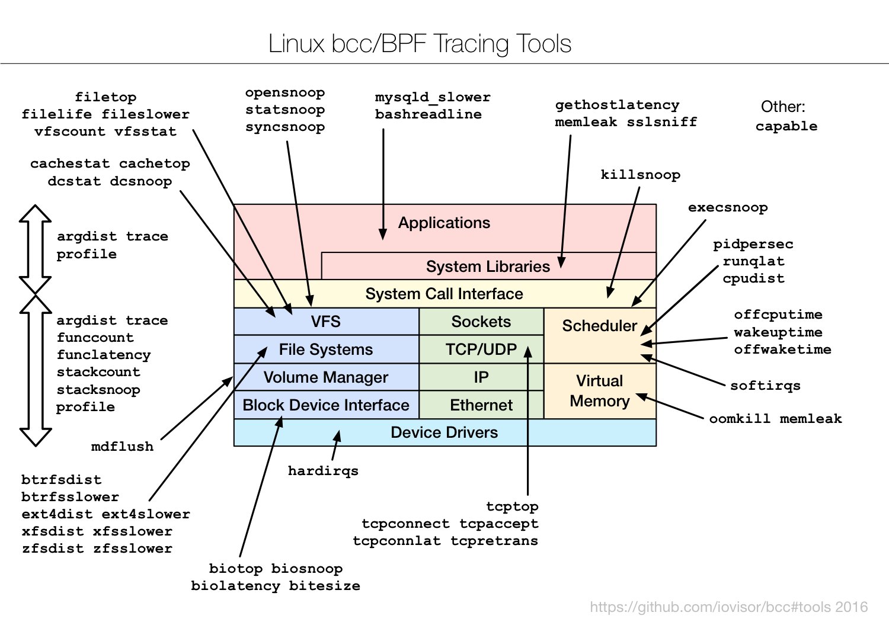

# BPF Compiler Collection (BCC)

BCC is a toolkit for creating efficient kernel tracing and manipulation
programs, and includes several useful tools and examples. It makes use of eBPF
(Extended Berkeley Packet Filters), a new feature that was first added to
Linux 3.15. Much of what BCC uses requires Linux 4.1 and above.

eBPF was [described by](https://lkml.org/lkml/2015/4/14/232) Ingo Molnár as:

> One of the more interesting features in this cycle is the ability to attach eBPF programs (user-defined, sandboxed bytecode executed by the kernel) to kprobes. This allows user-defined instrumentation on a live kernel image that can never crash, hang or interfere with the kernel negatively.

BCC makes eBPF programs easier to write, with kernel instrumentation in C
and a front-end in Python. It is suited for many tasks, including performance
analysis and network traffic control.

## Screenshot

This example traces a disk I/O kernel function, and populates an in-kernel
power-of-2 histogram of the I/O size. For efficiency, only the histogram
summary is returned to user-level.

```Shell
# ./bitehist.py 
Tracing... Hit Ctrl-C to end.
^C
     kbytes          : count     distribution
       0 -> 1        : 3        |                                      |
       2 -> 3        : 0        |                                      |
       4 -> 7        : 211      |**********                            |
       8 -> 15       : 0        |                                      |
      16 -> 31       : 0        |                                      |
      32 -> 63       : 0        |                                      |
      64 -> 127      : 1        |                                      |
     128 -> 255      : 800      |**************************************|
```

The above output shows a bimodal distribution, where the largest mode of
800 I/O was between 128 and 255 Kbytes in size.

See the source: [bitehist.c](examples/tracing/bitehist.c) and
[bitehist.py](examples/tracing/bitehist.py). What this traces, what this stores, and how
the data is presented, can be entirely customized. This shows only some of
many possible capabilities.

## Installing

See [INSTALL.md](INSTALL.md) for installation steps on your platform.

## FAQ

See [FAQ.txt](FAQ.txt) for the most common troubleshoot questions.

## Contents

Some of these are single files that contain both C and Python, others have a
pair of .c and .py files, and some are directories of files.

### Tracing

Examples:

- examples/tracing/[bitehist.py](examples/tracing/bitehist.py) examples/tracing/[bitehist.c](examples/tracing/bitehist.c): Block I/O size histogram. [Examples](examples/tracing/bitehist_example.txt).
- examples/tracing/[disksnoop.py](examples/tracing/disksnoop.py) examples/tracing/[disksnoop.c](examples/tracing/disksnoop.c): Trace block device I/O latency. [Examples](examples/tracing/disksnoop_example.txt).
- examples/[hello_world.py](examples/hello_world.py): Prints "Hello, World!" for new processes.
- examples/tracing/[tcpv4connect.py](examples/tracing/tcpv4connect.py): Trace TCP IPv4 active connections. [Examples](examples/tracing/tcpv4connect_example.txt).
- examples/tracing/[trace_fields.py](examples/tracing/trace_fields.py): Simple example of printing fields from traced events.
- examples/tracing/[vfsreadlat.py](examples/tracing/vfsreadlat.py) examples/tracing/[vfsreadlat.c](examples/tracing/vfsreadlat.c): VFS read latency distribution. [Examples](examples/tracing/vfsreadlat_example.txt).

#### Tools:
<center><a href="images/bcc_tracing_tools_2016.png"></a></center>
- tools/[argdist](tools/argdist.py): Display function parameter values as a histogram or frequency count. [Examples](tools/argdist_example.txt).
- tools/[bashreadline](tools/bashreadline.py): Print entered bash commands system wide. [Examples](tools/bashreadline_example.txt).
- tools/[biolatency](tools/biolatency.py): Summarize block device I/O latency as a histogram. [Examples](tools/biolatency_example.txt).
- tools/[biotop](tools/biotop.py): Top for disks: Summarize block device I/O by process. [Examples](tools/biotop_example.txt).
- tools/[biosnoop](tools/biosnoop.py): Trace block device I/O with PID and latency. [Examples](tools/biosnoop_example.txt).
- tools/[bitesize](tools/bitesize.py): Show per process I/O size histogram. [Examples](tools/bitesize_example.txt).
- tools/[btrfsdist](tools/btrfsdist.py): Summarize btrfs operation latency distribution as a histogram. [Examples](tools/btrfsdist_example.txt).
- tools/[btrfsslower](tools/btrfsslower.py): Trace slow btrfs operations. [Examples](tools/btrfsslower_example.txt).
- tools/[cachestat](tools/cachestat.py): Trace page cache hit/miss ratio. [Examples](tools/cachestat_example.txt).
- tools/[dcsnoop](tools/dcsnoop.py): Trace directory entry cache (dcache) lookups. [Examples](tools/dcsnoop_example.txt).
- tools/[dcstat](tools/dcstat.py): Directory entry cache (dcache) stats. [Examples](tools/dcstat_example.txt).
- tools/[execsnoop](tools/execsnoop.py): Trace new processes via exec() syscalls. [Examples](tools/execsnoop_example.txt).
- tools/[ext4dist](tools/ext4dist.py): Summarize ext4 operation latency distribution as a histogram. [Examples](tools/ext4dist_example.txt).
- tools/[ext4slower](tools/ext4slower.py): Trace slow ext4 operations. [Examples](tools/ext4slower_example.txt).
- tools/[filelife](tools/filelife.py): Trace the lifespan of short-lived files. [Examples](tools/filelife_example.txt).
- tools/[fileslower](tools/fileslower.py): Trace slow synchronous file reads and writes. [Examples](tools/fileslower_example.txt).
- tools/[filetop](tools/filetop.py): File reads and writes by filename and process. Top for files. [Examples](tools/filetop_example.txt).
- tools/[funccount](tools/funccount.py): Count kernel function calls. [Examples](tools/funccount_example.txt).
- tools/[funclatency](tools/funclatency.py): Time kernel functions and show their latency distribution. [Examples](tools/funclatency_example.txt).
- tools/[gethostlatency](tools/gethostlatency.py): Show latency for getaddrinfo/gethostbyname[2] calls. [Examples](tools/gethostlatency_example.txt).
- tools/[hardirqs](tools/hardirqs.py):  Measure hard IRQ (hard interrupt) event time. [Examples](tools/hardirqs_example.txt).
- tools/[killsnoop](tools/killsnoop.py): Trace signals issued by the kill() syscall. [Examples](tools/killsnoop_example.txt).
- tools/[mdflush](tools/mdflush.py): Trace md flush events. [Examples](tools/mdflush_example.txt).
- tools/[memleak](tools/memleak.py): Display outstanding memory allocations to find memory leaks. [Examples](tools/memleak_example.txt).
- tools/[offcputime](tools/offcputime.py): Summarize off-CPU time by kernel stack trace. [Examples](tools/offcputime_example.txt).
- tools/[offwaketime](tools/offwaketime.py): Summarize blocked time by kernel off-CPU stack and waker stack. [Examples](tools/offwaketime_example.txt).
- tools/[oomkill](tools/oomkill.py): Trace the out-of-memory (OOM) killer. [Examples](tools/oomkill_example.txt).
- tools/[opensnoop](tools/opensnoop.py): Trace open() syscalls. [Examples](tools/opensnoop_example.txt).
- tools/[pidpersec](tools/pidpersec.py): Count new processes (via fork). [Examples](tools/pidpersec_example.txt).
- tools/[runqlat](tools/runqlat.py): Run queue (scheduler) latency as a histogram. [Examples](tools/runqlat_example.txt).
- tools/[softirqs](tools/softirqs.py):  Measure soft IRQ (soft interrupt) event time. [Examples](tools/softirqs_example.txt).
- tools/[solisten](tools/solisten.py): Trace TCP socket listen. [Examples](tools/solisten_example.txt).
- tools/[stackcount](tools/stackcount.py): Count kernel function calls and their stack traces. [Examples](tools/stackcount_example.txt).
- tools/[stacksnoop](tools/stacksnoop.py): Trace a kernel function and print all kernel stack traces. [Examples](tools/stacksnoop_example.txt).
- tools/[statsnoop](tools/statsnoop.py): Trace stat() syscalls. [Examples](tools/statsnoop_example.txt).
- tools/[syncsnoop](tools/syncsnoop.py): Trace sync() syscall. [Examples](tools/syncsnoop_example.txt).
- tools/[tcpaccept](tools/tcpaccept.py): Trace TCP passive connections (accept()). [Examples](tools/tcpaccept_example.txt).
- tools/[tcpconnect](tools/tcpconnect.py): Trace TCP active connections (connect()). [Examples](tools/tcpconnect_example.txt).
- tools/[tcpconnlat](tools/tcpconnlat.py): Trace TCP active connection latency (connect()). [Examples](tools/tcpconnlat_example.txt).
- tools/[tcpretrans](tools/tcpretrans.py): Trace TCP retransmits and TLPs. [Examples](tools/tcpretrans_example.txt).
- tools/[tplist](tools/tplist.py): Display kernel tracepoints or USDT probes and their formats. [Examples](tools/tplist_example.txt).
- tools/[trace](tools/trace.py): Trace arbitrary functions, with filters. [Examples](tools/trace_example.txt)
- tools/[vfscount](tools/vfscount.py) tools/[vfscount.c](tools/vfscount.c): Count VFS calls. [Examples](tools/vfscount_example.txt).
- tools/[vfsstat](tools/vfsstat.py) tools/[vfsstat.c](tools/vfsstat.c): Count some VFS calls, with column output. [Examples](tools/vfsstat_example.txt).
- tools/[wakeuptime](tools/wakeuptime.py): Summarize sleep to wakeup time by waker kernel stack. [Examples](tools/wakeuptime_example.txt).
- tools/[xfsdist](tools/xfsdist.py): Summarize XFS operation latency distribution as a histogram. [Examples](tools/xfsdist_example.txt).
- tools/[xfsslower](tools/xfsslower.py): Trace slow XFS operations. [Examples](tools/xfsslower_example.txt).
- tools/[zfsdist](tools/zfsdist.py): Summarize ZFS operation latency distribution as a histogram. [Examples](tools/zfsdist_example.txt).
- tools/[zfsslower](tools/zfsslower.py): Trace slow ZFS operations. [Examples](tools/zfsslower_example.txt).

### Networking

Examples:

- examples/networking/[distributed_bridge/](examples/networking/distributed_bridge): Distributed bridge example.
- examples/networking/[http_filter/](examples/networking/http_filter): Simple HTTP filter example.
- examples/networking/[simple_tc.py](examples/networking/simple_tc.py): Simple traffic control example.
- examples/networking/[simulation.py](examples/networking/simulation.py): Simulation helper.
- examples/networking/neighbor_sharing/[tc_neighbor_sharing.py](examples/networking/neighbor_sharing/tc_neighbor_sharing.py) examples/networking/neighbor_sharing/[tc_neighbor_sharing.c](examples/networking/neighbor_sharing/tc_neighbor_sharing.c): Per-IP classification and rate limiting.
- examples/networking/[tunnel_monitor/](examples/networking/tunnel_monitor): Efficiently monitor traffic flows. [Example video](https://www.youtube.com/watch?v=yYy3Cwce02k).
- examples/networking/vlan_learning/[vlan_learning.py](examples/networking/vlan_learning/vlan_learning.py) examples/[vlan_learning.c](examples/networking/vlan_learning/vlan_learning.c): Demux Ethernet traffic into worker veth+namespaces.

## Motivation

BPF guarantees that the programs loaded into the kernel cannot crash, and
cannot run forever, but yet BPF is general purpose enough to perform many
arbitrary types of computation. Currently, it is possible to write a program in
C that will compile into a valid BPF program, yet it is vastly easier to
write a C program that will compile into invalid BPF (C is like that). The user
won't know until trying to run the program whether it was valid or not.

With a BPF-specific frontend, one should be able to write in a language and
receive feedback from the compiler on the validity as it pertains to a BPF
backend. This toolkit aims to provide a frontend that can only create valid BPF
programs while still harnessing its full flexibility.

Furthermore, current integrations with BPF have a kludgy workflow, sometimes
involving compiling directly in a linux kernel source tree. This toolchain aims
to minimize the time that a developer spends getting BPF compiled, and instead
focus on the applications that can be written and the problems that can be
solved with BPF.

The features of this toolkit include:
* End-to-end BPF workflow in a shared library
  * A modified C language for BPF backends
  * Integration with llvm-bpf backend for JIT
  * Dynamic (un)loading of JITed programs
  * Support for BPF kernel hooks: socket filters, tc classifiers,
      tc actions, and kprobes
* Bindings for Python
* Examples for socket filters, tc classifiers, and kprobes
* Self-contained tools for tracing a running system

In the future, more bindings besides python will likely be supported. Feel free
to add support for the language of your choice and send a pull request!

## Tutorial

The BCC toolchain is currently composed of two parts: a C wrapper around LLVM,
and a Python API to interact with the running program. Later, we will go into
more detail of how this all works.

### Hello, World

First, we should include the BPF class from the bpf module:
```python
from bcc import BPF
```

Since the C code is so short, we will embed it inside the python script.

The BPF program always takes at least one argument, which is a pointer to the
context for this type of program. Different program types have different calling
conventions, but for this one we don't care so `void *` is fine.
```python
BPF(text='void kprobe__sys_clone(void *ctx) { bpf_trace_printk("Hello, World!\\n"); }').trace_print()
```

For this example, we will call the program every time `fork()` is called by a
userspace process. Underneath the hood, fork translates to the `clone` syscall.
BCC recognizes prefix `kprobe__`, and will auto attach our program to the kernel symbol `sys_clone`.

The python process will then print the trace printk circular buffer until ctrl-c
is pressed. The BPF program is removed from the kernel when the userspace
process that loaded it closes the fd (or exits).

Output:
```
bcc/examples$ sudo python hello_world.py
          python-7282  [002] d...  3757.488508: : Hello, World!
```

For an explanation of the meaning of the printed fields, see the trace_pipe
section of the [kernel ftrace doc](https://www.kernel.org/doc/Documentation/trace/ftrace.txt).

[Source code listing](examples/hello_world.py)

### Networking

At Red Hat Summit 2015, BCC was presented as part of a [session on BPF](http://www.devnation.org/#7784f1f7513e8542e4db519e79ff5eec).
A multi-host vxlan environment is simulated and a BPF program used to monitor
one of the physical interfaces. The BPF program keeps statistics on the inner
and outer IP addresses traversing the interface, and the userspace component
turns those statistics into a graph showing the traffic distribution at
multiple granularities. See the code [here](examples/networking/tunnel_monitor).

[](https://youtu.be/yYy3Cwce02k)

### Tracing

Here is a slightly more complex tracing example than Hello World. This program
will be invoked for every task change in the kernel, and record in a BPF map
the new and old pids.

The C program below introduces two new concepts.
The first is the macro `BPF_TABLE`. This defines a table (type="hash"), with key
type `key_t` and leaf type `u64` (a single counter). The table name is `stats`,
containing 1024 entries maximum. One can `lookup`, `lookup_or_init`, `update`,
and `delete` entries from the table.
The second concept is the prev argument. This argument is treated specially by
the BCC frontend, such that accesses to this variable are read from the saved
context that is passed by the kprobe infrastructure. The prototype of the args
starting from position 1 should match the prototype of the kernel function being
kprobed. If done so, the program will have seamless access to the function
parameters.
```c
#include <uapi/linux/ptrace.h>
#include <linux/sched.h>

struct key_t {
  u32 prev_pid;
  u32 curr_pid;
};
// map_type, key_type, leaf_type, table_name, num_entry
BPF_TABLE("hash", struct key_t, u64, stats, 1024);
// attach to finish_task_switch in kernel/sched/core.c, which has the following
// prototype:
//   struct rq *finish_task_switch(struct task_struct *prev)
int count_sched(struct pt_regs *ctx, struct task_struct *prev) {
  struct key_t key = {};
  u64 zero = 0, *val;

  key.curr_pid = bpf_get_current_pid_tgid();
  key.prev_pid = prev->pid;

  val = stats.lookup_or_init(&key, &zero);
  (*val)++;
  return 0;
}
```
[Source code listing](examples/tracing/task_switch.c)

The userspace component loads the file shown above, and attaches it to the
`finish_task_switch` kernel function.
The [] operator of the BPF object gives access to each BPF_TABLE in the
program, allowing pass-through access to the values residing in the kernel. Use
the object as you would any other python dict object: read, update, and deletes
are all allowed.
```python
from bcc import BPF
from time import sleep

b = BPF(src_file="task_switch.c")
b.attach_kprobe(event="finish_task_switch", fn_name="count_sched")

# generate many schedule events
for i in range(0, 100): sleep(0.01)

for k, v in b["stats"].items():
    print("task_switch[%5d->%5d]=%u" % (k.prev_pid, k.curr_pid, v.value))
```
[Source code listing](examples/tracing/task_switch.py)

## Getting started

See [INSTALL.md](INSTALL.md) for installation steps on your platform.

## Contributing

Already pumped up to commit some code? Here are some resources to join the
discussions in the [IOVisor](https://www.iovisor.org/) community and see
what you want to work on.

* _Mailing List:_ http://lists.iovisor.org/mailman/listinfo/iovisor-dev
* _IRC:_ #iovisor at irc.oftc.net
* _IRC Logs:_ https://scrollback.io/iovisor/all
* _BCC Issue Tracker:_ [Github Issues](https://github.com/iovisor/bcc/issues)
* _A guide for contributing scripts:_ [CONTRIBUTING-SCRIPTS.md](CONTRIBUTING-SCRIPTS.md)
