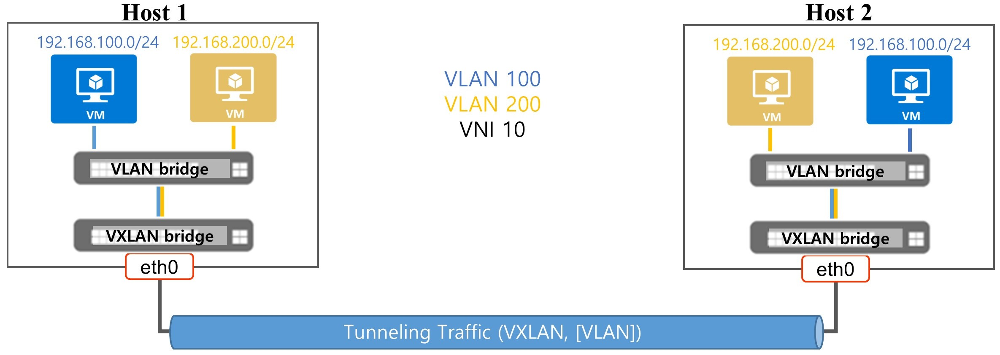

# VLAN Filter #
This is eBPF application to parse VXLAN packets and then extracts encapsulated VLAN packets to monitor traffic from each VLAN. Extracted packet header fields can be stored in a file or sent to remote server via Apache Kafka messaging system.

Also part of this example is a simulation of a multi-host environment. Simulation environment can be setup by using test_setup.sh script. Then a sample script (traffic.sh) can be used to send traffic from one client (VLAN=100) from host1 talking to another client at host2 and one client (VLAN=200) from host2 talking to another client at host1 while running vlan_filter application in parallel by using command 'python data-plane-tracing -i veth7'.

### Usage Example ###
* $ sudo python data-plane-tracing.py

Timestamp | Host Name  | Host IP   | IP Version   | Source Host IP   | Dest Host IP   | Source Host Port   | Dest Host Port   | VNI   | Source VM MAC  | Dest VM MAC  | VLAN ID  | Source VM IP   | Dest VM IP   | Protocol   | Source VM Port   | Dest VM Port   | Packet Length   |
---|---|---|---|---|---|---|---|---|---|---|---|---|---|---|---|---|---
 2018-05-24 18:43:30.386228 | Box1 | x.x.x.x  | 4 | 10.1.1.11 | 10.1.1.12 | 54836 | 4789 | 10 | fa:16:3e:ec:22:99 | fa:16:3e:1c:6f:2d | 100 | 192.168.100.11 | 192.168.100.12 | 6 | 1285 | 20302 | 1200

# Implementation overview #
Example application implementation is split into two parts: the former that exploits eBPF code, the latter that performs some additional processing in user space (python wrapper).

### First part: eBPF Filter ###
This component filters VXLAN packets.
The program is loaded as PROG_TYPE_SOCKET_FILTER and attached to a socket, bind to eth0.
Packets matching VXLAN filter are forwarded to the user space, while other packets are dropped.

### Python code in user space ###
The Python script reads filtered raw packets from the socket, extracts all the useful header fields and stores extracted packet into a file by default or can be sent to a remote server via Apache Kafka messaging system.

# How to execute this example application #
VLAN Filter application can be executed by using one of the below commands:
* $ sudo python data-plane-tracing.py
* $ sudo python data-plane-tracing -i eth2 -k vc.manage.overcloud:9092

# How to install Required Dependencies
* $ pip install kafka-python
* $ pip install netifaces
